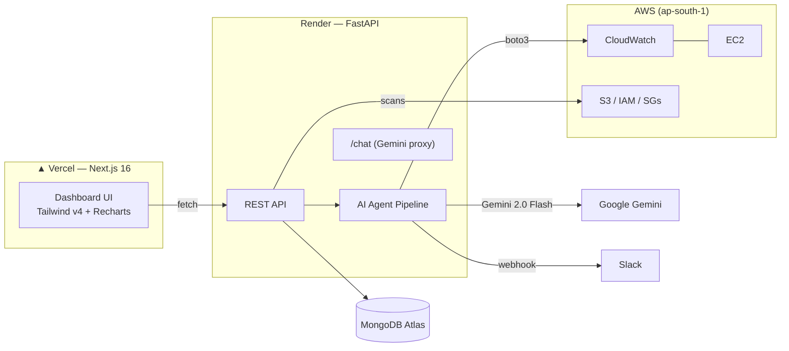

# ☁️ CloudPilot AI — Autonomous DevOps Assistant

An AI-powered cloud monitoring platform that **detects, diagnoses, and fixes AWS incidents** — with a human in the loop for every deployment.

**🔗 Live Demo:** [cloudpilot-ai-three.vercel.app](https://cloudpilot-ai-three.vercel.app)
**🔑 Demo login:** `demo@cloudpilot.ai` / `demo123`

---

## 🧠 What it does

CloudPilot runs a pipeline of four AI agents over live AWS CloudWatch data:

```
CloudWatch Metrics ──▶ 🔍 Anomaly Detector ──▶ 🧠 RCA Agent ──▶ 🔧 Fix Agent ──▶ 📝 Report Writer
                          (threshold scan)      (Gemini AI        (Terraform        (Slack incident
                                                 root cause)       remediation)      report)
                                                                       │
                                                              👤 Human Approval
                                                              (Approve & Deploy / Reject)
```

1. **Anomaly Detector** — scans EC2 CPU metrics from CloudWatch against a configurable threshold
2. **RCA Agent** — Gemini AI analyzes the anomaly window and writes a root cause with confidence level
3. **Fix Agent** — generates a concrete Terraform change to remediate the issue
4. **Report Writer** — posts a formatted incident report to Slack
5. **Human approval** — no fix deploys without an engineer clicking *Approve* — the approval, rejection, and every action is audit-logged

## ✨ Features

| Area | Highlights |
|---|---|
| 📊 **Live Dashboard** | Real CloudWatch CPU/network charts, cloud health score, agent status, AI insights of the day |
| 🚨 **Incidents** | Detailed incident pages with minute-by-minute timeline, severity, search & filters, PDF export |
| ✅ **Approvals** | Human-in-the-loop remediation with execution progress and Slack notifications |
| 💰 **Cost Agent** | Live boto3 scan for unattached EBS volumes, unused Elastic IPs, stopped instances — with estimated monthly savings |
| 🛡️ **Security Agent** | Scans security groups, S3 public access, and IAM MFA — produces a security score |
| 🤖 **AI Chatbot** | Gemini-powered assistant (voice input/output) that knows your live incident data |
| ⚡ **Command Palette** | `Ctrl+K` universal search across pages, actions, and incidents |
| 📋 **Audit Logs** | Every sign-in, pipeline run, approval, and download is recorded |
| 📈 **Analytics** | MTTR, incident trends, severity distribution |
| 🔔 **Notifications** | In-app notification center + Slack alerts |
| 📱 **Responsive** | Mobile drawer navigation, touch-friendly cards, dark theme |

## 🏗️ Architecture



## 🛠️ Tech Stack

- **Frontend:** Next.js 16 (App Router, Turbopack), React 19, Tailwind CSS v4, Recharts, lucide-react, jsPDF
- **Backend:** FastAPI, boto3, PyMongo, Google Gemini (`gemini-2.0-flash`)
- **Infra:** Vercel (frontend), Render (backend), MongoDB Atlas, AWS CloudWatch/EC2, Slack webhooks

## 🚀 Getting Started

### Backend

```bash
cd backend
python -m venv venv
venv\Scripts\activate        # Windows  ·  source venv/bin/activate on macOS/Linux
pip install -r requirements.txt
uvicorn main:app --reload
```

Create `backend/.env`:

| Variable | Purpose |
|---|---|
| `AWS_REGION` | e.g. `ap-south-1` |
| `EC2_INSTANCE_ID` | Instance to monitor |
| `GEMINI_API_KEY` | Google AI Studio key (free tier works) |
| `SLACK_WEBHOOK_URL` | Incoming webhook for incident reports |
| `MONGODB_URL` | MongoDB Atlas connection string |
| `CPU_ANOMALY_THRESHOLD` | Optional, default `70` (%) |

AWS credentials come from the standard AWS CLI configuration / environment.

### Frontend

```bash
cd frontend
npm install
npm run dev        # http://localhost:3000
```

## 🎬 Try the full flow

1. Generate real load on the monitored EC2 instance:
   ```bash
   stress-ng --cpu 2 --timeout 300
   ```
2. Wait ~5 minutes for CloudWatch to record the spike
3. Click **🚀 Run Agent Pipeline** on the dashboard
4. Watch the agents detect the anomaly, write a root cause, and draft a Terraform fix
5. Review and **Approve & Deploy** on the Approvals page — the report lands in Slack and the action is audit-logged

## 👩‍💻 Author

**Tanisha Garg** — [github.com/tanishagargcoder](https://github.com/tanishagargcoder)
